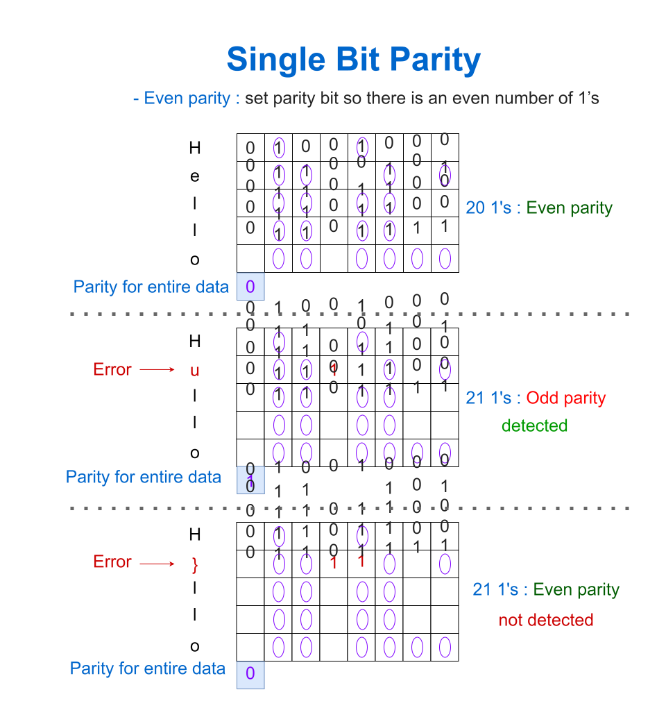
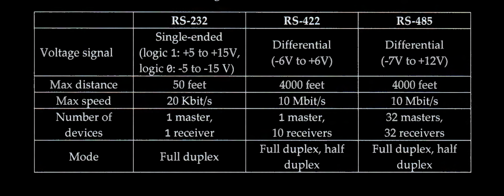

## IO Electrical Characteristics

  

  

---
# Serial Communication
* Serial communication transfers a single bit each time and uses either a single wire for each communication direction or a shared wire for both directions.

## Universal Asynchronous Receiver and Transmitter (UART)

* The keyword "universal" means the serial interface is programmable. 
* The asynchronous transmission allows bits to be transmitted in a serial fashion without requiring the sender to provide a clock signal to the receiver (it can be configured to communicate synchronously, which is then called USART).
    * However, both senders and receivers must agree on the data transmission rate before the communication starts.
    * The sender and the receiver should use the same baud rate to set up the clock agreement.
*  In digital systems, the baud rate is the bit rate, i.e., the number of bits transmitted per second.
    * In some analog systems, such as modems, the baud rate is larger than the corresponding bit rate when there are more than two voltage levels and a voltage signal transmitted can represent multiple bits.

* With full-duplex communication, data is always transmitted out bit by bit from
the TX line and is received by the other device on its RX line. The receiver
reassembles bits received into bytes.

* With the single-wire half-duplex communication, TX and RX are internally
connected, and only one wire is used. TX is used for both sending and receiving
data. In this mode, TX pins are pulled up externally because these two pins must
be configured as open-drain.

### Frame

* A frame is the smallest unit of
communication.

* In a frame:
    * The data length (7, 8, or 9 bits)
    * The parity bit (even, odd, or no parity)
    * The number of stop bits (0.5, 1, 1.5, or 2 bits)
    * The data order (MSB or LSB first) are configurable

* Each frame begins with a start bit, represented by a low-level voltage.
* After the start bit, the individual bits of each frame are shifted out of one UART interface and into another.

* When the sender sends a frame, the sender can optionally calculate the parity of this frame and send the parity bit to the receiver for error checking.
    *  Even parity. The combination of data bits and the parity bit contains an even number of 1s.
    * Odd parity. The total number of l s in the data bits and the parity bit is an odd number.

* Each frame ends with a stop bit, represented by a high voltage. If no further data is transmitted, the voltage of the transmission line remains high.
    * The number of stop bit in each frame is usually one by default.
    * If the receiver does not obtain the stop bit, the current frame is considered corrupted and discarded.

## Oversampling

* As the transmitter and receiver clocks are independent of each other, oversampling is an
effective approach to mitigate the effects of clock deviation and avoid corruption by high-
frequency noise. The most commonly used sampling rate is 8 or 16 times the baud rate.
* The receiver samples each bit 8 or 16 times and uses
these values to estimate the middle of each bit pulse, resulting in a more reliable and
robust transmission link.

## Baud Rate

Historically the baud rate was used in telecommunications to represent the number of pulses or transitions physically transferred per second.
* By using phase shift and other technologies, a pulse on phone lines can represent multiple binary bits, resulting in a bit rate larger than the baud rate.
* In digital communication systems, because each pulse represents a single bit, the baud rate is the number of bits physically transferred per second, including the actual data content and the protocol overhead, leading to a bit rate lower than the baud rate.

  

## UART Standards

* Voltage signals for UART are defined in different standards, such as RS-232, RS-422, and RS-485.
* The prefix RS stands for "recommended standard.

* Differential signaling uses two twisted wires with equal but opposite signals to transmit digital data. 
* Electrical noise can be inducted into the signal wires or can be generated by the voltage difference
between two ground references. 
* Noise is coupled into both wires equally. 
    * Therefore, the noise can be canceled out at the receiver. 

